# QR Art Gallery

Scannable QR art outputs that decode to `https://github.com/briankwest/qrart`.
Every image below is a real QR code — point your phone at it.

_Built 2026-05-29T15:16:29+00:00 · 56 entries · 15 categories · min scan score 0.9_

Generated with [QR Art Studio](https://github.com/briankwest/qrcode) — a local Stable Diffusion 1.5 + QR Monster ControlNet generator with 200 one-click presets, multi-scanner verification, and an automated calibration tool.

## 🟦 Modern & Abstract

<table>
  <tr>
    <td align="center" width="33%" valign="top">
      <a href="gallery/picasso-cubist.png">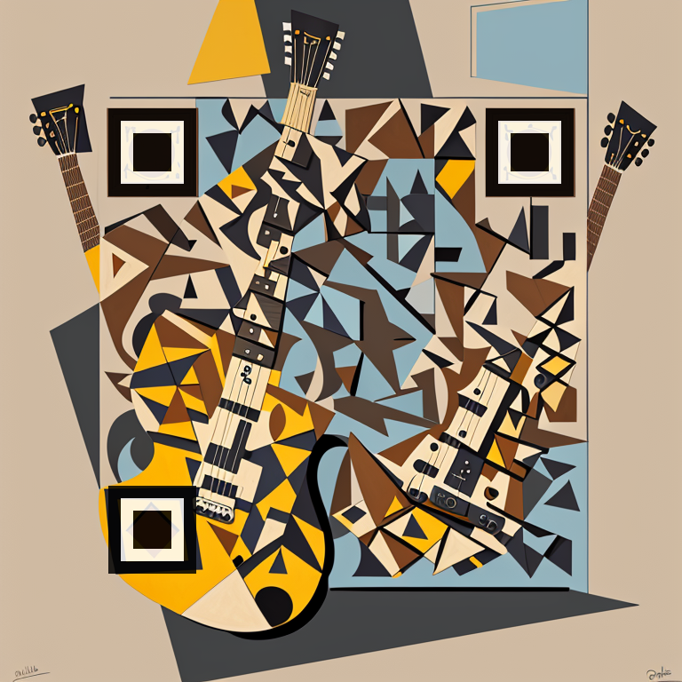</a>
       <b>Picasso (cubist)</b>
       a guitar still life in the style of Pablo Picasso cubist period, fractured geometric planes, multiple viewpoints overlapping, muted earth to…
       ★ 0.98 · seed 737493834 · scale 1.45 · dreamshaper
    </td>
    <td align="center" width="33%" valign="top">
      
       <b>Kandinsky</b>
       a musical composition visualized reimagined in the style of Wassily Kandinsky, floating abstract geometric shapes, vivid circles and triangl…
       ★ 0.97 · seed 1679666913 · scale 1.65 · dreamshaper
    </td>
    <td align="center" width="33%" valign="top">
      <a href="gallery/klee.png">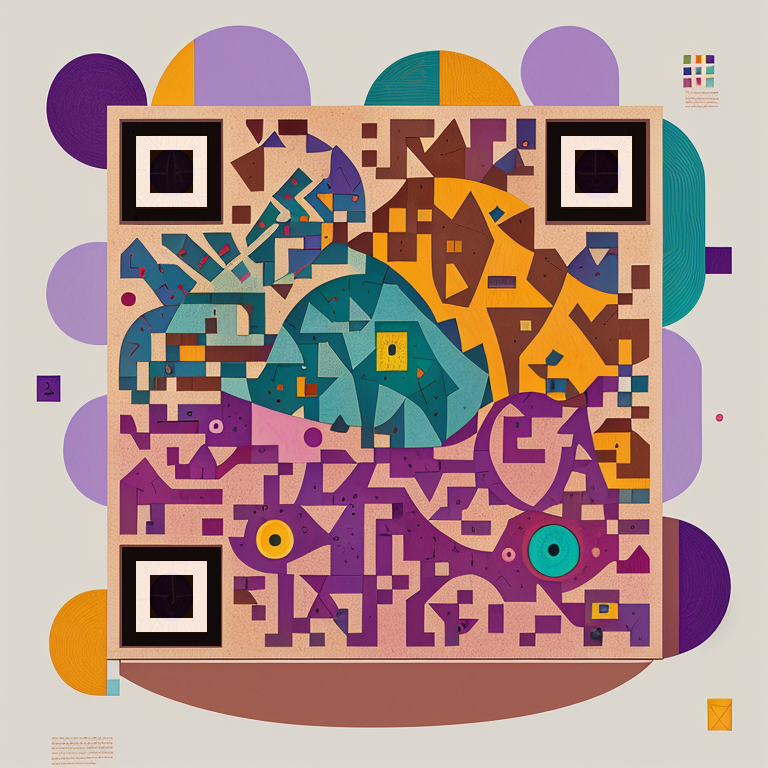</a>
       <b>Klee</b>
       a twittering machine reimagined in the style of Paul Klee, whimsical pictographic illustration, childlike simplified forms, muted earth tone…
       ★ 0.99 · seed 1716297163 · scale 1.56 · dreamshaper
    </td>
  </tr>
  <tr>
    <td align="center" width="33%" valign="top">
      <a href="gallery/pollock.png">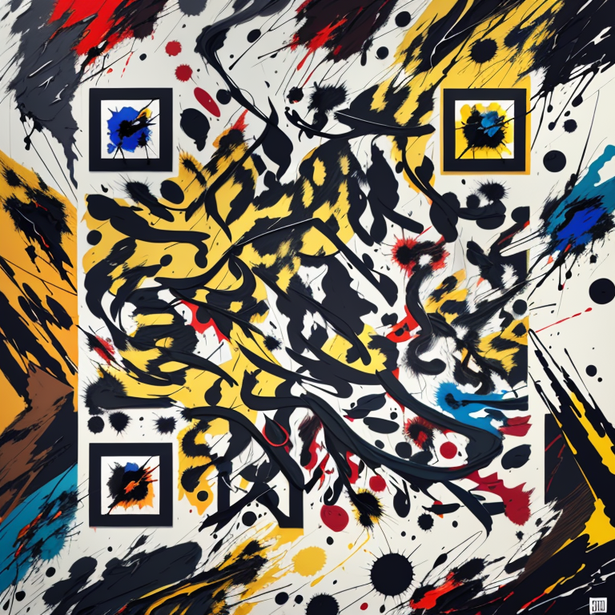</a>
       <b>Pollock</b>
       a chaotic dance of color interpreted as action drip painting in the style of Jackson Pollock, dense layered splatters of black and white and…
       ★ 1.00 · seed 787693810 · scale 1.69 · dreamshaper
    </td>
    <td align="center" width="33%" valign="top">
      <a href="gallery/rothko.png">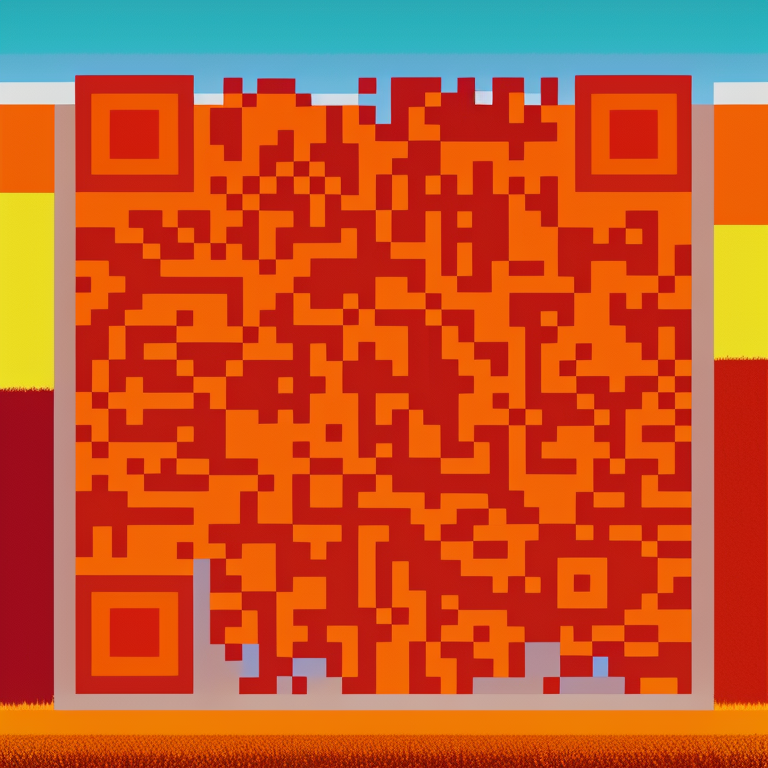</a>
       <b>Rothko (color field)</b>
       fields of orange and red interpreted in the style of Mark Rothko, soft-edged stacked rectangular color fields, luminous color, contemplative…
       ★ 1.00 · seed 7592986 · scale 1.75 · dreamshaper
    </td>
    <td></td>
  </tr>
</table>

## 🌀 Surrealist

<table>
  <tr>
    <td align="center" width="33%" valign="top">
      <a href="gallery/dali.png">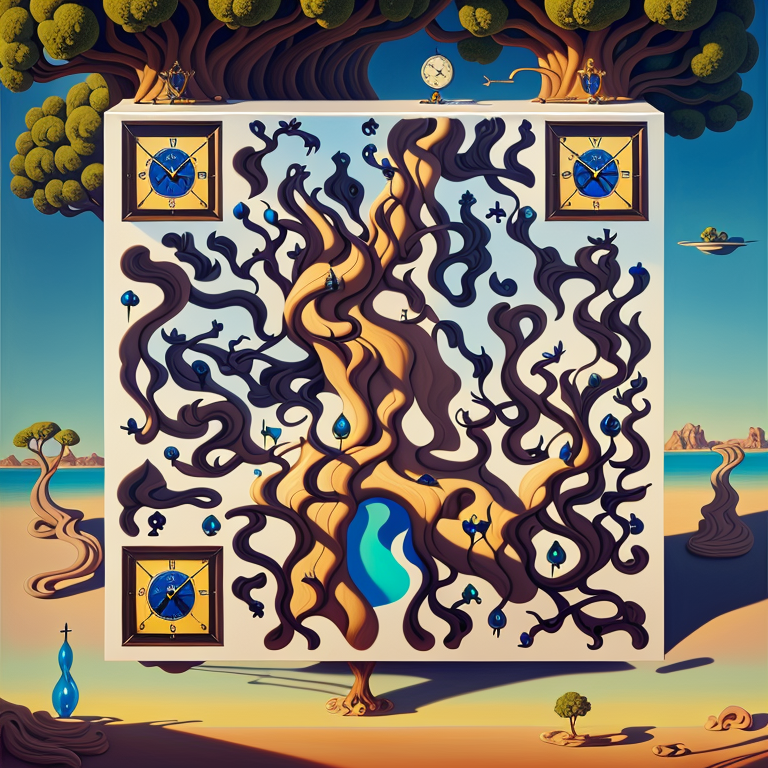</a>
       <b>Dalí</b>
       melting clocks on a tree in the style of Salvador Dalí, melting surrealist forms, infinite dreamlike landscape with low horizon, long dramat…
       ★ 0.99 · seed 426767105 · scale 1.56 · dreamshaper
    </td>
    <td align="center" width="33%" valign="top">
      
       <b>Magritte</b>
       a man in bowler hat with apple face in the style of René Magritte, conceptual surrealism, clean-edged Belgian sky-blue and bourgeois charcoa…
       ★ 1.00 · seed 16427934 · scale 1.56 · dreamshaper
    </td>
    <td align="center" width="33%" valign="top">
      <a href="gallery/bosch.png">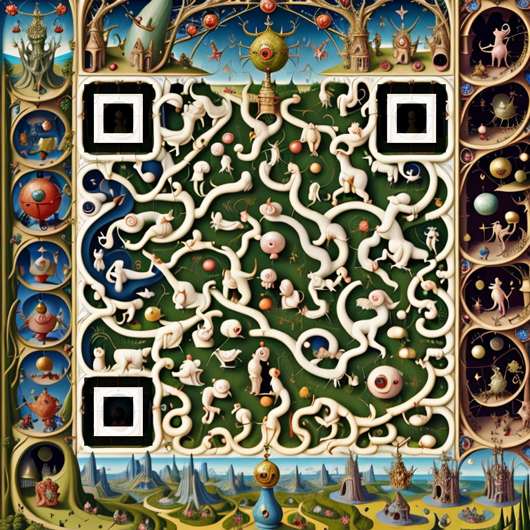</a>
       <b>Bosch</b>
       a fantastical paradise garden in the style of Hieronymus Bosch, medieval surreal triptych, densely crowded with fantastical creatures and gr…
       ★ 1.00 · seed 952208702 · scale 1.66 · dreamshaper
    </td>
  </tr>
  <tr>
    <td align="center" width="33%" valign="top">
      
       <b>M.C. Escher</b> ★
       an impossible staircase in the style of M.C. Escher, impossible geometric architecture, tessellating interlocking shapes, black-and-white li…
       ★ 0.98 · seed 2018697035 · scale 1.56 · dreamshaper
    </td>
    <td></td>
    <td></td>
  </tr>
</table>

## 🎨 Stylized / Artistic

<table>
  <tr>
    <td align="center" width="33%" valign="top">
      <a href="gallery/cherry-blossom.png">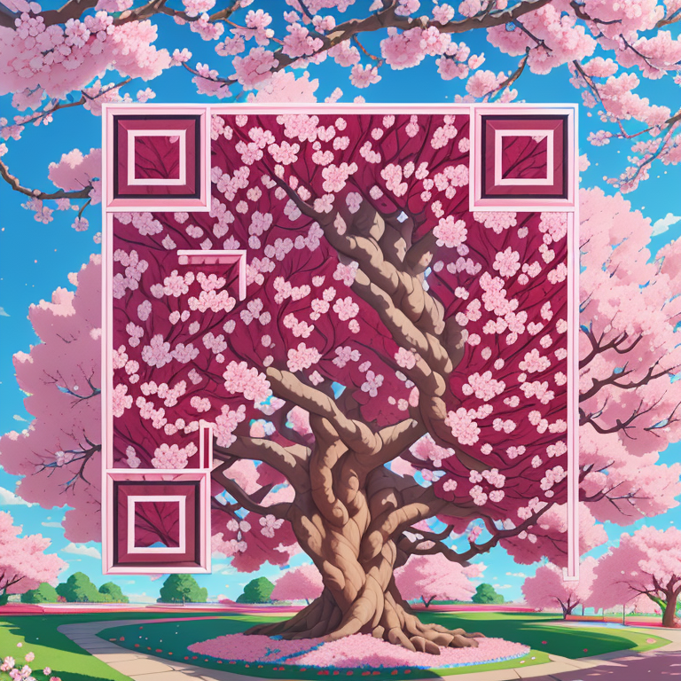</a>
       <b>Cherry blossom canopy</b> ★
       massive cherry tree in full bloom, dense pink cherry blossom canopy filling the frame, bright blue sky peeking through, soft natural lightin…
       ★ 0.99 · seed 1459759364 · scale 1.56 · dreamshaper
    </td>
    <td align="center" width="33%" valign="top">
      <a href="gallery/fantasy-temple.png">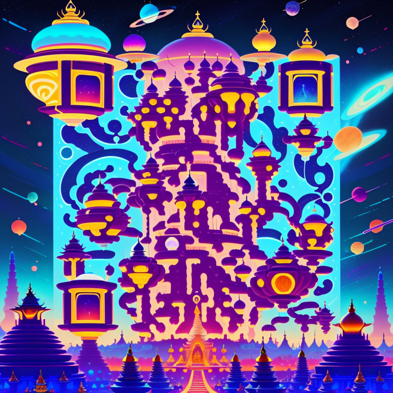</a>
       <b>Fantasy temple cluster</b> ★
       holy city of cosmos floating in space, futuristic fantasy neon-lit landscape with dense cluster of ornate Indian temple domes and stupas str…
       ★ 0.99 · seed 874104538 · scale 1.63 · dreamshaper
    </td>
    <td align="center" width="33%" valign="top">
      <a href="gallery/stained-glass.png">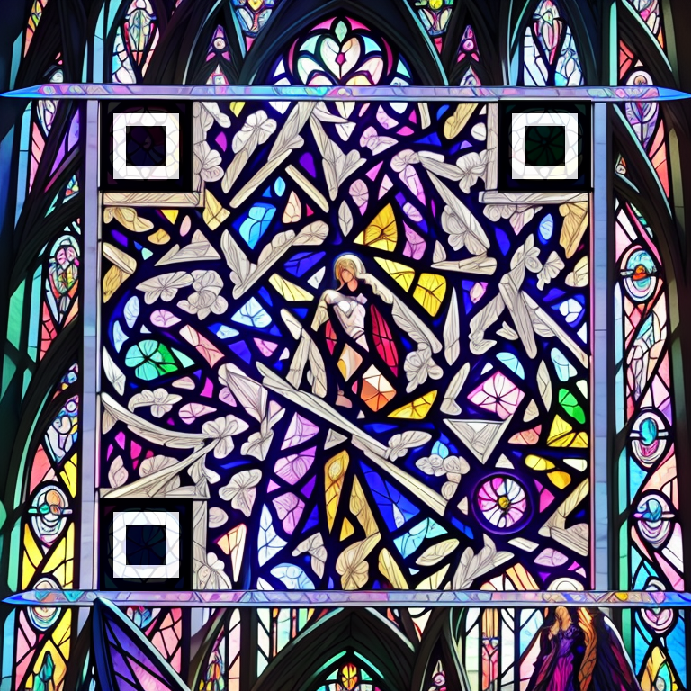</a>
       <b>Stained glass window</b>
       a soaring angel, intricate cathedral stained glass window, vivid jewel-tone colors, lead came outlines, sunlight refracting through each pan…
       ★ 0.98 · seed 1682737846 · scale 1.63 · dreamshaper
    </td>
  </tr>
  <tr>
    <td align="center" width="33%" valign="top">
      <a href="gallery/watercolor-painterly.png">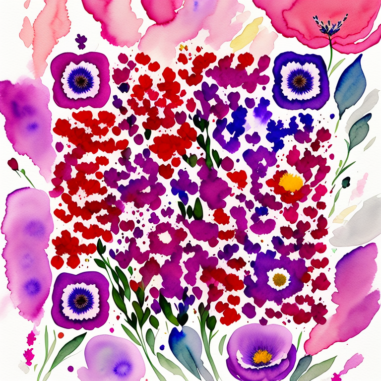</a>
       <b>Watercolor painterly</b>
       botanical study of flowers, traditional watercolor painting, soft flowing washes of color bleeding into each other, paper texture visible, l…
       ★ 0.99 · seed 1741704075 · scale 1.44 · openjourney
    </td>
    <td align="center" width="33%" valign="top">
      <a href="gallery/neon-synthwave.png">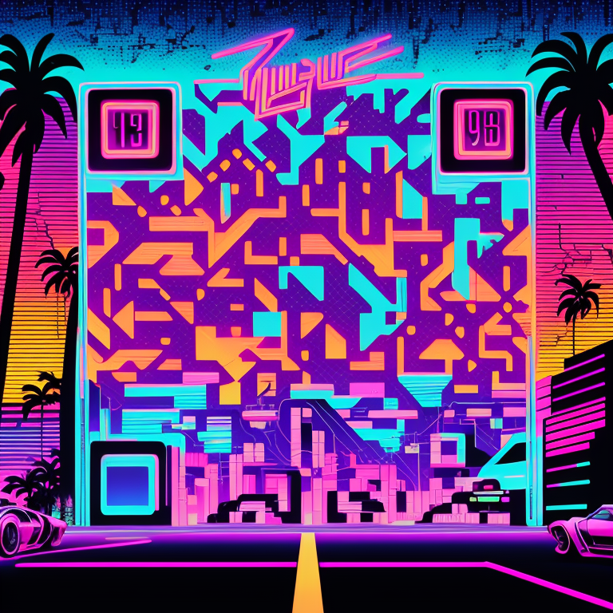</a>
       <b>Neon synthwave</b>
       chrome muscle car on neon highway, 1980s synthwave retrofuture aesthetic, vivid magenta and cyan and orange neon gradient sky, grid horizon…
       ★ 1.00 · seed 1318351261 · scale 1.55 · dreamshaper
    </td>
    <td></td>
  </tr>
</table>

## 👑 Classic Masters

<table>
  <tr>
    <td align="center" width="33%" valign="top">
      <a href="gallery/rembrandt.png">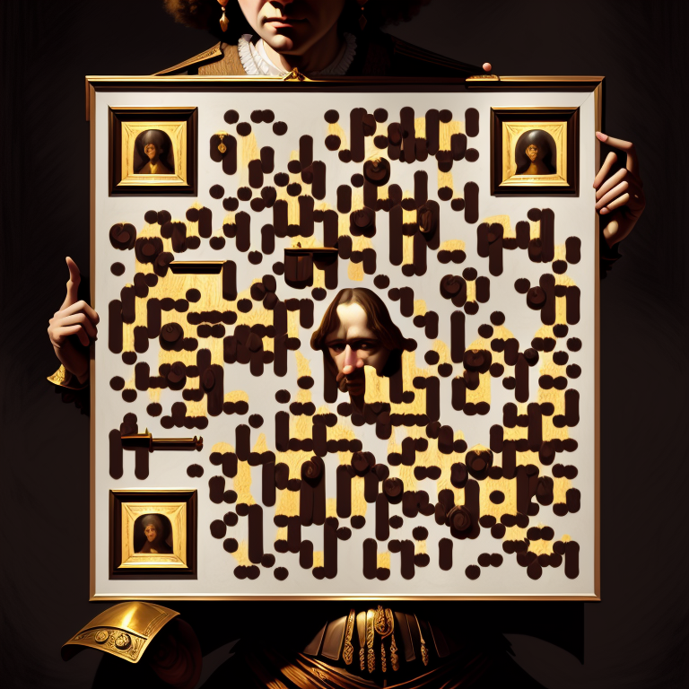</a>
       <b>Rembrandt</b>
       a self-portrait in the style of Rembrandt van Rijn, dramatic chiaroscuro lighting, Dutch Golden Age oil painting, deep umber and gold palett…
       ★ 1.00 · seed 1032389817 · scale 1.56 · dreamshaper
    </td>
    <td align="center" width="33%" valign="top">
      <a href="gallery/vermeer.png">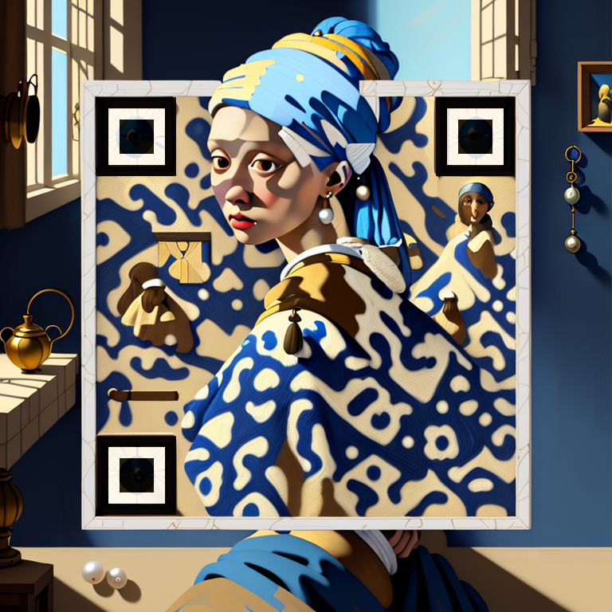</a>
       <b>Vermeer</b>
       girl with a pearl earring in the style of Johannes Vermeer, soft northern window light, Dutch interior scene, luminous textures of fabric an…
       ★ 0.97 · seed 322312743 · scale 1.45 · dreamshaper
    </td>
    <td align="center" width="33%" valign="top">
      
       <b>Caravaggio</b>
       the calling of Saint Matthew in the style of Caravaggio, intense Baroque chiaroscuro, dramatic moment captured, deep shadows with raking lig…
       ★ 0.99 · seed 2096763437 · scale 1.56 · dreamshaper
    </td>
  </tr>
  <tr>
    <td align="center" width="33%" valign="top">
      
       <b>Hokusai</b>
       the great wave with Mount Fuji in the style of Katsushika Hokusai, traditional Japanese ukiyo-e woodblock print, bold black outlines, flat p…
       ★ 0.98 · seed 186913564 · scale 1.56 · dreamshaper
    </td>
    <td align="center" width="33%" valign="top">
      <a href="gallery/klimt.png">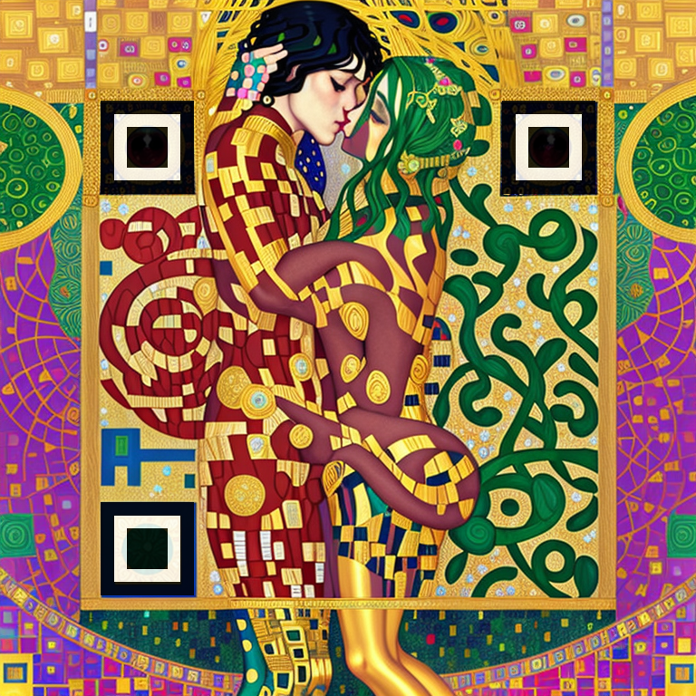</a>
       <b>Klimt</b> ★
       the kiss embrace of lovers in the style of Gustav Klimt, gold leaf and ornate Byzantine patterns, decorative spirals and eyes and geometric…
       ★ 0.97 · seed 1552640805 · scale 1.56 · dreamshaper
    </td>
    <td></td>
  </tr>
</table>

## 🖋️ Stylized & Illustration

<table>
  <tr>
    <td align="center" width="33%" valign="top">
      
       <b>Mucha (Art Nouveau)</b>
       an Art Nouveau goddess in the style of Alphonse Mucha, Art Nouveau ornate flowing borders, sinuous decorative lines, elegant figure surround…
       ★ 0.99 · seed 770203802 · scale 1.56 · dreamshaper
    </td>
    <td align="center" width="33%" valign="top">
      <a href="gallery/ghibli.png">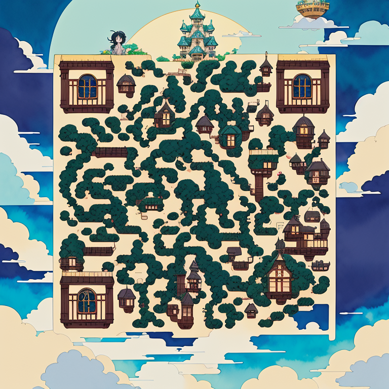</a>
       <b>Miyazaki / Ghibli</b>
       a flying castle in clouds, Studio Ghibli anime aesthetic in the style of Hayao Miyazaki, soft watercolor and ink illustration, lush nature w…
       ★ 0.99 · seed 287053807 · scale 1.56 · dreamshaper
    </td>
    <td align="center" width="33%" valign="top">
      <a href="gallery/hopper.png">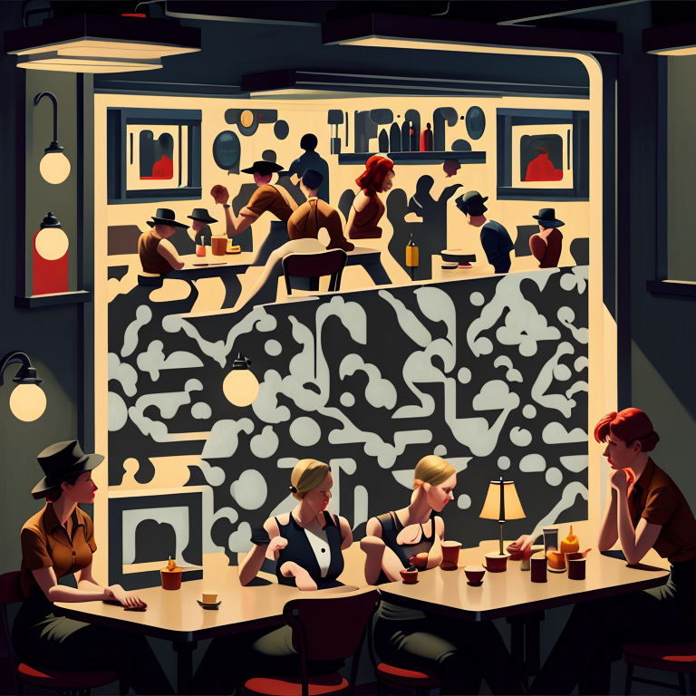</a>
       <b>Edward Hopper</b>
       a late-night diner with single patron in the style of Edward Hopper, American realism painting, melancholic atmosphere, dramatic raking sunl…
       ★ 0.99 · seed 138996726 · scale 1.56 · dreamshaper
    </td>
  </tr>
  <tr>
    <td align="center" width="33%" valign="top">
      <a href="gallery/frazetta.png">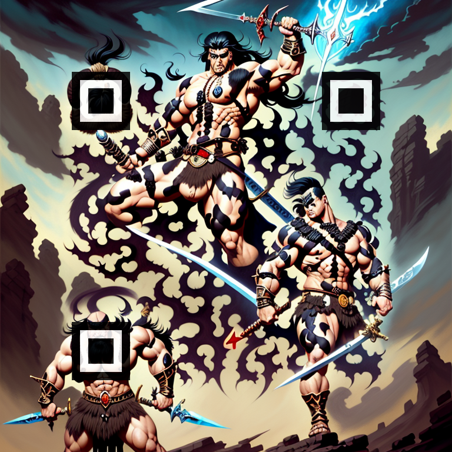</a>
       <b>Frazetta (heroic fantasy)</b>
       a barbarian warrior with sword in the style of Frank Frazetta, heroic fantasy oil painting, dramatic muscular figures in dynamic action, omi…
       ★ 0.99 · seed 285470831 · scale 1.56 · dreamshaper
    </td>
    <td align="center" width="33%" valign="top">
      <a href="gallery/beksinski.png">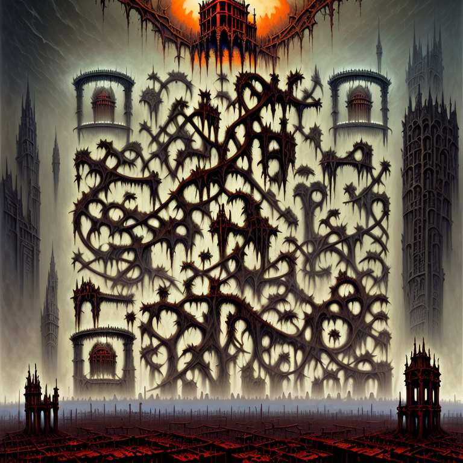</a>
       <b>Beksiński</b>
       towering rusted cathedral ruins in the style of Zdzisław Beksiński, dystopian surreal landscape, towering rusted twisted architecture, foreb…
       ★ 0.99 · seed 750468486 · scale 1.56 · dreamshaper
    </td>
    <td></td>
  </tr>
</table>

## 🌻 Impressionist

<table>
  <tr>
    <td align="center" width="33%" valign="top">
      <a href="gallery/van-gogh.png">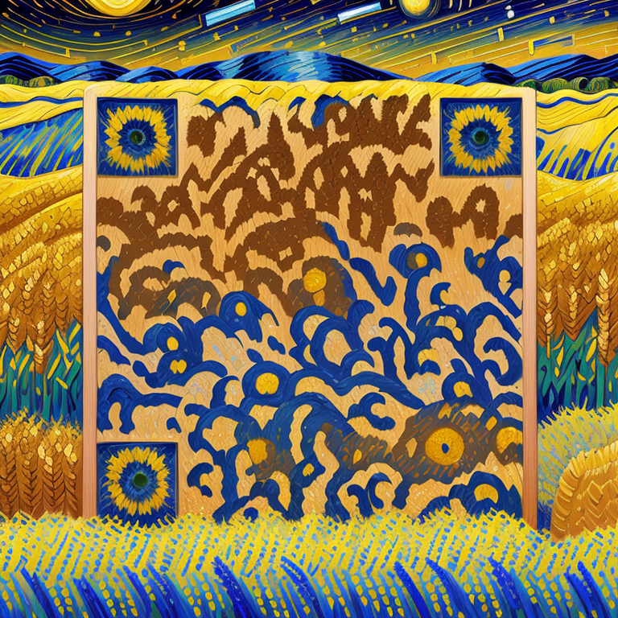</a>
       <b>Van Gogh</b>
       a wheat field at sunset in the style of Vincent Van Gogh, swirling impasto brushwork, thick textured oil paint, post-impressionist, vibrant…
       ★ 0.99 · seed 2121209733 · scale 1.56 · dreamshaper
    </td>
    <td align="center" width="33%" valign="top">
      <a href="gallery/monet.png">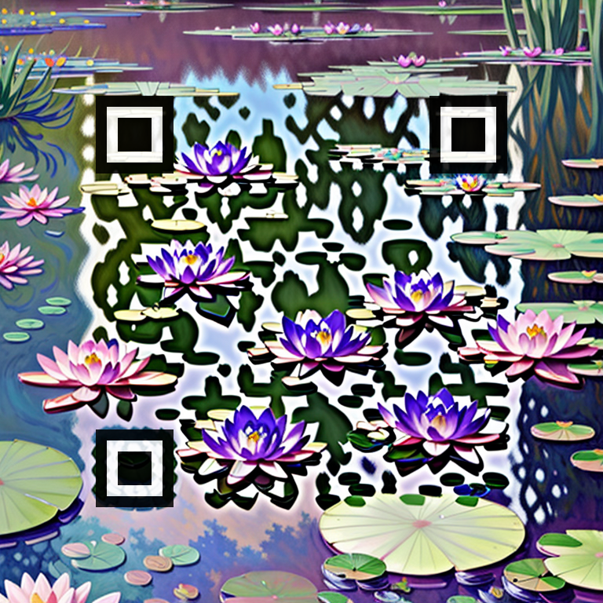</a>
       <b>Monet</b>
       water lilies on a pond in the style of Claude Monet, soft impressionist brushwork, broken color, dappled light on water, hazy atmospheric ha…
       ★ 0.98 · seed 1683443773 · scale 1.56 · dreamshaper
    </td>
    <td align="center" width="33%" valign="top">
      <a href="gallery/cezanne.png">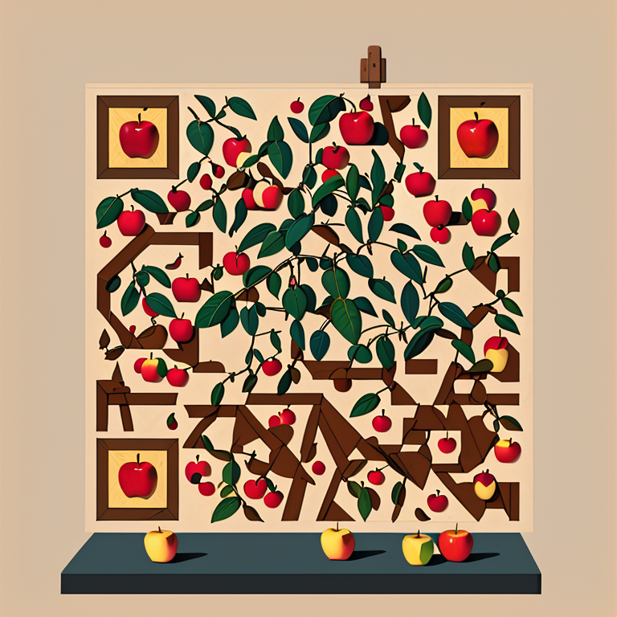</a>
       <b>Cézanne</b>
       a still life of apples and a vase in the style of Paul Cézanne, structured geometric brushwork, planes of color, post-impressionist still li…
       ★ 0.99 · seed 1121830324 · scale 1.56 · dreamshaper
    </td>
  </tr>
  <tr>
    <td align="center" width="33%" valign="top">
      <a href="gallery/renoir.png">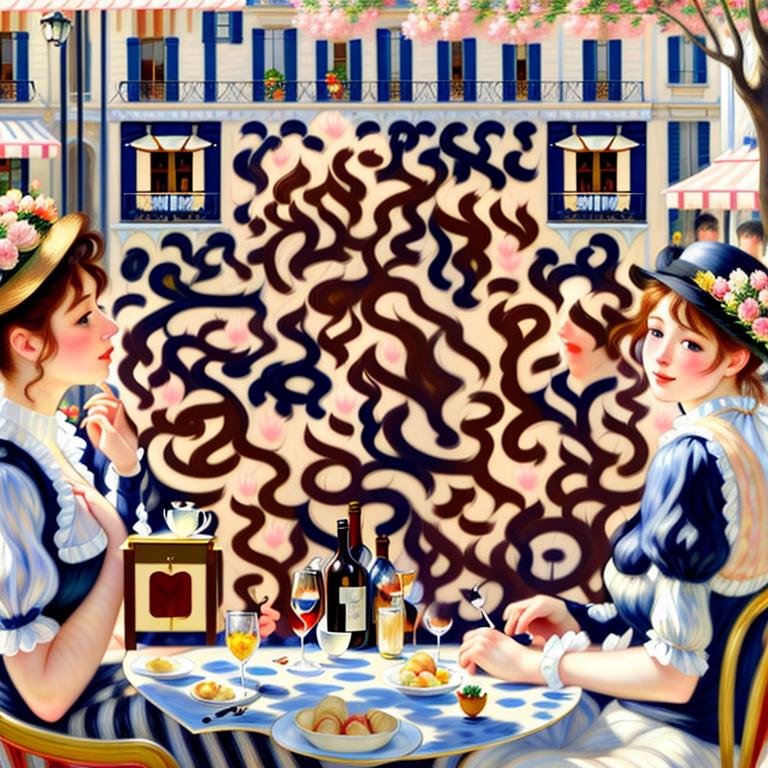</a>
       <b>Renoir</b>
       a Parisian café luncheon in the style of Pierre-Auguste Renoir, soft warm impressionist brushwork, rosy skin tones, dappled sunlight, lively…
       ★ 0.99 · seed 1581517992 · scale 1.55 · dreamshaper
    </td>
    <td align="center" width="33%" valign="top">
      <a href="gallery/degas.png">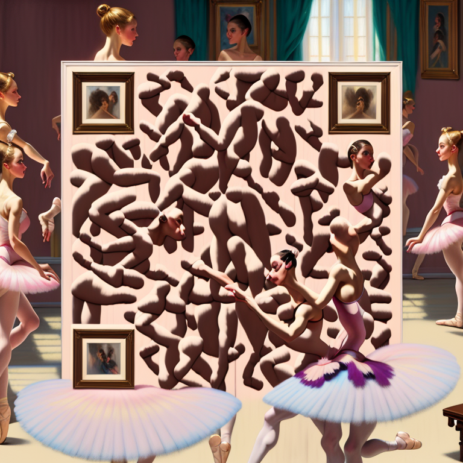</a>
       <b>Degas</b>
       ballet dancers backstage in the style of Edgar Degas, soft pastel impressionist technique, candid behind-the-scenes moment, off-balance comp…
       ★ 0.99 · seed 75798944 · scale 1.56 · dreamshaper
    </td>
    <td align="center" width="33%" valign="top">
      
       <b>Toulouse-Lautrec</b>
       a Moulin Rouge cabaret dancer in the style of Henri de Toulouse-Lautrec, bold poster art composition, flat planes of color, expressive line…
       ★ 0.99 · seed 1921299773 · scale 1.56 · dreamshaper
    </td>
  </tr>
</table>

## 💥 Pop & Street

<table>
  <tr>
    <td align="center" width="33%" valign="top">
      <a href="gallery/warhol.png">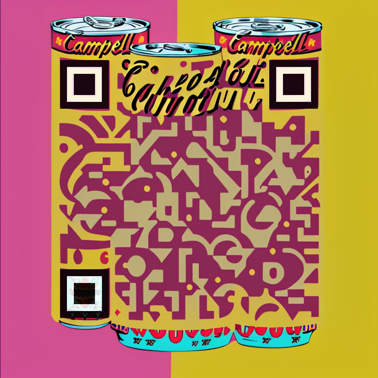</a>
       <b>Warhol</b>
       a Campbell's soup can in the style of Andy Warhol pop art, silk-screen technique with flat planes of vivid color, high-contrast portrait or…
       ★ 0.98 · seed 2033808078 · scale 1.56 · dreamshaper
    </td>
    <td align="center" width="33%" valign="top">
      <a href="gallery/lichtenstein.png">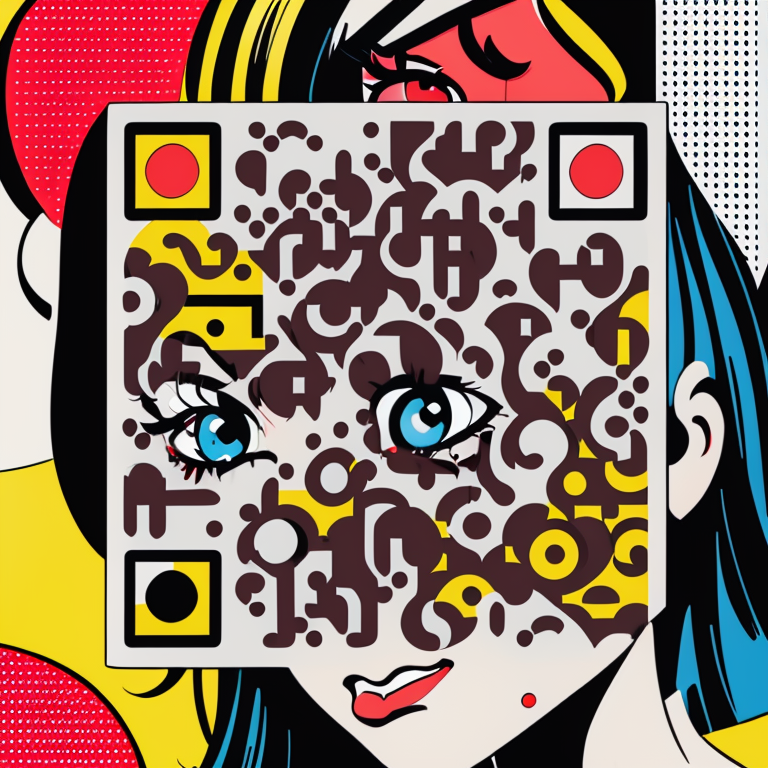</a>
       <b>Lichtenstein</b> ★
       a girl crying with a tear in the style of Roy Lichtenstein pop art, comic book panel composition, thick black outlines, primary red blue and…
       ★ 0.99 · seed 1585996285 · scale 1.56 · dreamshaper
    </td>
    <td align="center" width="33%" valign="top">
      <a href="gallery/banksy.png">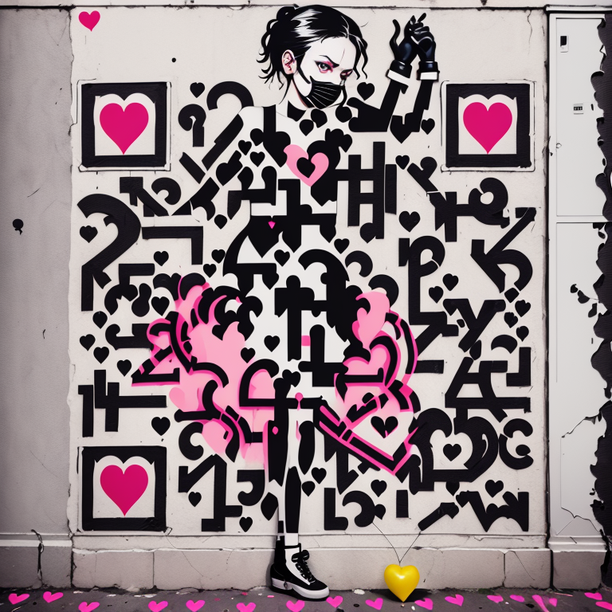</a>
       <b>Banksy</b>
       a girl releasing a balloon heart in the style of Banksy, street art stencil with spray paint, weathered urban wall background with graffiti…
       ★ 0.99 · seed 1105175949 · scale 1.56 · dreamshaper
    </td>
  </tr>
  <tr>
    <td align="center" width="33%" valign="top">
      
       <b>Basquiat</b>
       a figure with three-point crown in the style of Jean-Michel Basquiat, neo-expressionist raw painting, scribbled black outlines, scrawled tex…
       ★ 0.98 · seed 1431553318 · scale 1.56 · dreamshaper
    </td>
    <td></td>
    <td></td>
  </tr>
</table>

## 🏙️ Architecture & Urban

<table>
  <tr>
    <td align="center" width="33%" valign="top">
      
       <b>City skyline at night</b>
       Chicago skyline viewed from Lake Michigan at midnight, skyscrapers glowing with thousands of warm amber window lights against a deep indigo…
       ★ 0.96 · seed 2142035364 · scale 1.35 · cyberrealistic
    </td>
    <td align="center" width="33%" valign="top">
      <a href="gallery/cyberpunk-megacity.png">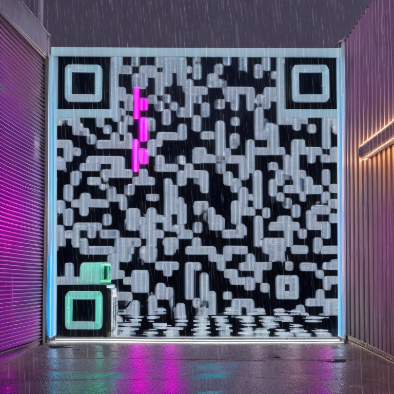</a>
       <b>Cyberpunk megacity</b>
       futuristic Tokyo alley at midnight, dense rain-soaked neon-lit cyberpunk megacity, holographic billboards reflecting in puddles, steam from…
       ★ 0.99 · seed 538276128 · scale 1.28 · cyberrealistic
    </td>
    <td></td>
  </tr>
</table>

## 🎮 Modern digital aesthetics

<table>
  <tr>
    <td align="center" width="33%" valign="top">
      
       <b>Pixar / 3D animation</b>
       a curious child exploring, Pixar-style 3D animated film aesthetic, expressive character design, warm cinematic lighting, smooth subsurface s…
       ★ 0.99 · seed 1394171812 · scale 1.25 · dreamshaper
    </td>
    <td></td>
    <td></td>
  </tr>
</table>

## 🦁 Wildlife & Nature

<table>
  <tr>
    <td align="center" width="33%" valign="top">
      
       <b>Wildlife portrait</b>
       Malayan tiger portrait, sharp focused eyes, detailed fur texture, intense expression, wildlife photography, blurred natural background
       ★ 0.98 · seed 1395304275 · scale 0.96 · majicmix
    </td>
    <td align="center" width="33%" valign="top">
      <a href="gallery/flower-field.png">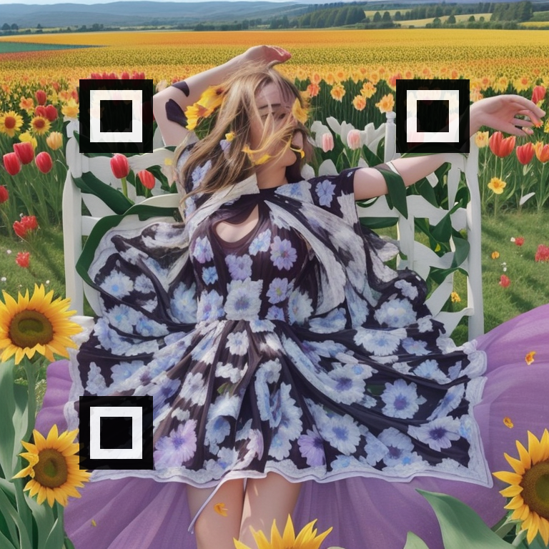</a>
       <b>Flower field</b>
       vast vibrant flower field stretching to the horizon featuring bands of tulips and sunflowers, dense blooms with intricate petals and stems,…
       ★ 0.96 · seed 920366890 · scale 1.25 · majicmix
    </td>
    <td align="center" width="33%" valign="top">
      <a href="gallery/forest-light-shafts.png">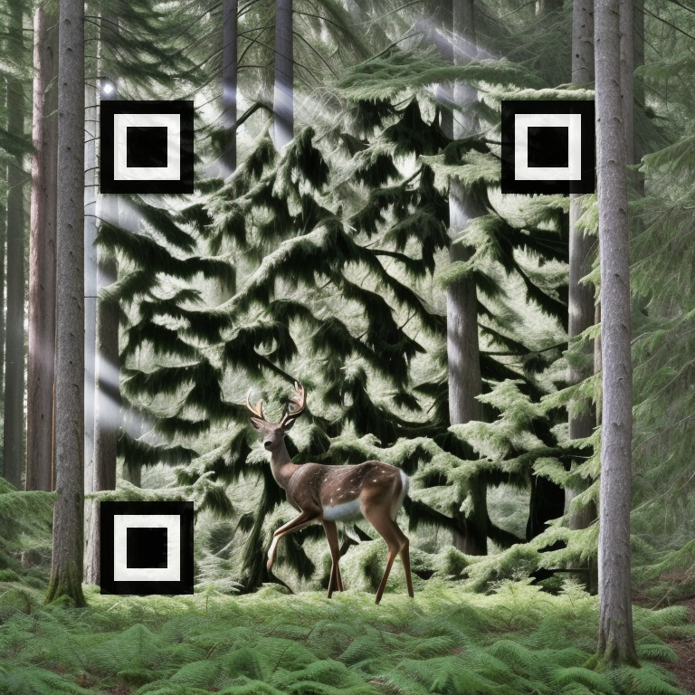</a>
       <b>Forest light shafts</b>
       a deer at the forest edge, ancient old-growth forest interior with dramatic god rays piercing mist, towering pine and redwood trunks, moss-c…
       ★ 0.96 · seed 564192099 · scale 1.25 · photon
    </td>
  </tr>
  <tr>
    <td align="center" width="33%" valign="top">
      <a href="gallery/aurora-night.png">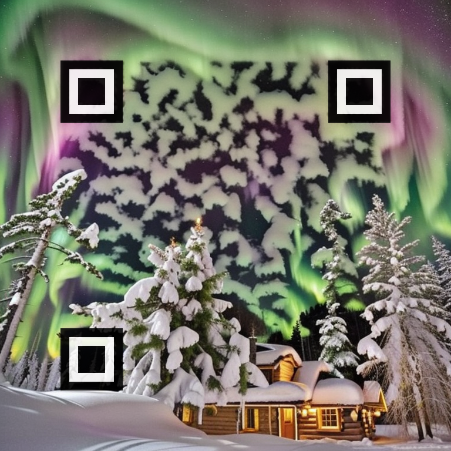</a>
       <b>Aurora night sky</b>
       wooden alpine cabin glowing warm yellow under vivid green and purple aurora borealis swirling across the night sky, deep snow blanketing the…
       ★ 0.97 · seed 2030187817 · scale 1.28 · photoreal
    </td>
    <td></td>
    <td></td>
  </tr>
</table>

## 🧵 Craft / textile mediums

<table>
  <tr>
    <td align="center" width="33%" valign="top">
      <a href="gallery/embroidery.png">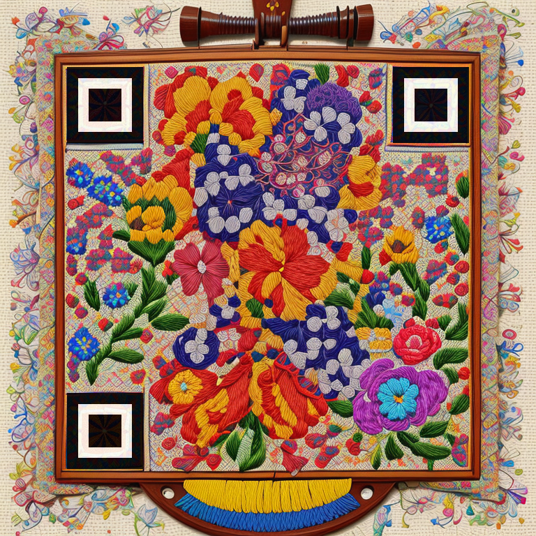</a>
       <b>Embroidery / cross-stitch</b> ★
       a folk-art floral pattern, hand-embroidered cross-stitch art, visible thread texture and stitch direction, linen fabric background, vibrant…
       ★ 0.98 · seed 988819137 · scale 1.55 · dreamshaper
    </td>
    <td align="center" width="33%" valign="top">
      <a href="gallery/linocut-woodcut.png">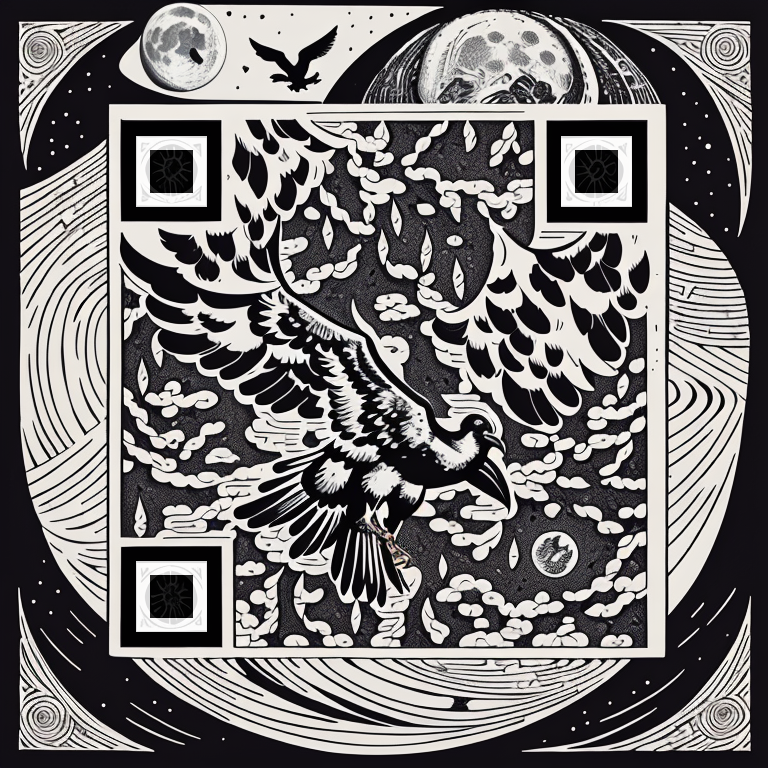</a>
       <b>Linocut / woodcut print</b>
       a soaring crow over a moon, bold linocut block print, thick black ink on textured paper, dramatic positive-negative space, expressive carved…
       ★ 0.97 · seed 1768587741 · scale 1.35 · dreamshaper
    </td>
    <td align="center" width="33%" valign="top">
      
       <b>Ceramic / pottery surface</b>
       a raku-fired tea bowl, hand-thrown ceramic pottery surface with textured glaze, organic wabi-sabi imperfections, earthy clay tones with vivi…
       ★ 0.96 · seed 399328531 · scale 1.25 · dreamshaper
    </td>
  </tr>
</table>

## 📷 Photographic genres

<table>
  <tr>
    <td align="center" width="33%" valign="top">
      
       <b>Black &amp; white / film noir</b>
       a brooding detective in a fedora, dramatic black and white photography, high-contrast chiaroscuro lighting, deep inky blacks and luminous hi…
       ★ 0.97 · seed 1164293221 · scale 1.15 · epicphoto
    </td>
    <td align="center" width="33%" valign="top">
      
       <b>Long exposure</b>
       car light trails through a city, long-exposure photography, silky streaks of motion, dramatic light trails, deep blue or starlit sky, atmosp…
       ★ 0.97 · seed 2077116094 · scale 1.15 · photoreal
    </td>
    <td align="center" width="33%" valign="top">
      <a href="gallery/tilt-shift.png">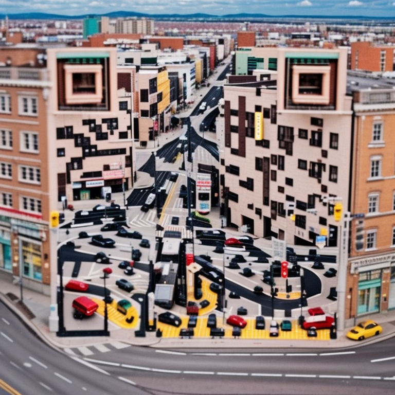</a>
       <b>Tilt-shift miniature</b>
       a busy city intersection from above, tilt-shift miniature photography effect, looks like a tiny model diorama, selective focus blurring fore…
       ★ 0.98 · seed 1485293406 · scale 1.60 · photoreal
    </td>
  </tr>
  <tr>
    <td align="center" width="33%" valign="top">
      <a href="gallery/polaroid-vintage.png">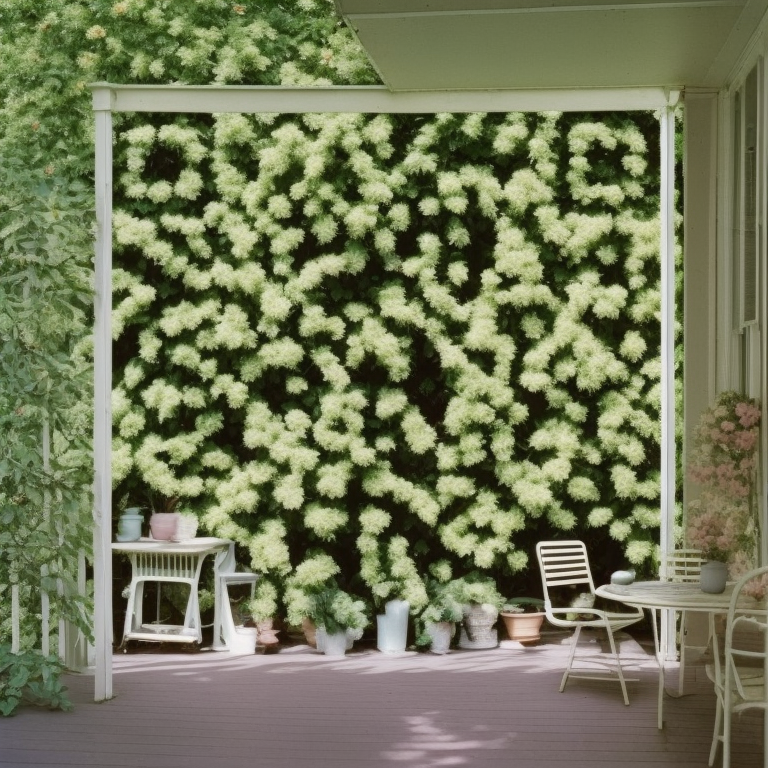</a>
       <b>Polaroid vintage film</b>
       a sun-drenched summer porch, vintage Polaroid instant film photograph, washed out warm faded colors, soft light leaks, slight blur and grain…
       ★ 0.98 · seed 1554347163 · scale 1.35 · analog
    </td>
    <td align="center" width="33%" valign="top">
      <a href="gallery/aerial-drone.png">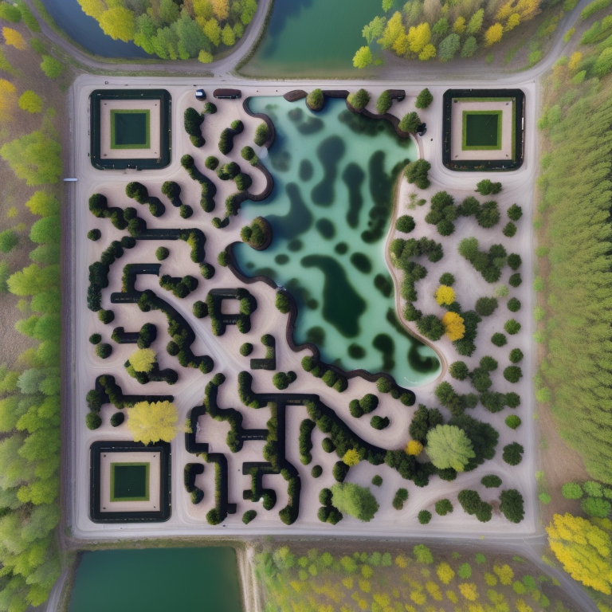</a>
       <b>Aerial / drone</b>
       a winding river through autumn forest, aerial drone photography, top-down bird's-eye view, geometric patterns from above, dramatic landscape…
       ★ 0.98 · seed 1452875693 · scale 1.55 · photon
    </td>
    <td align="center" width="33%" valign="top">
      <a href="gallery/macro-nature.png">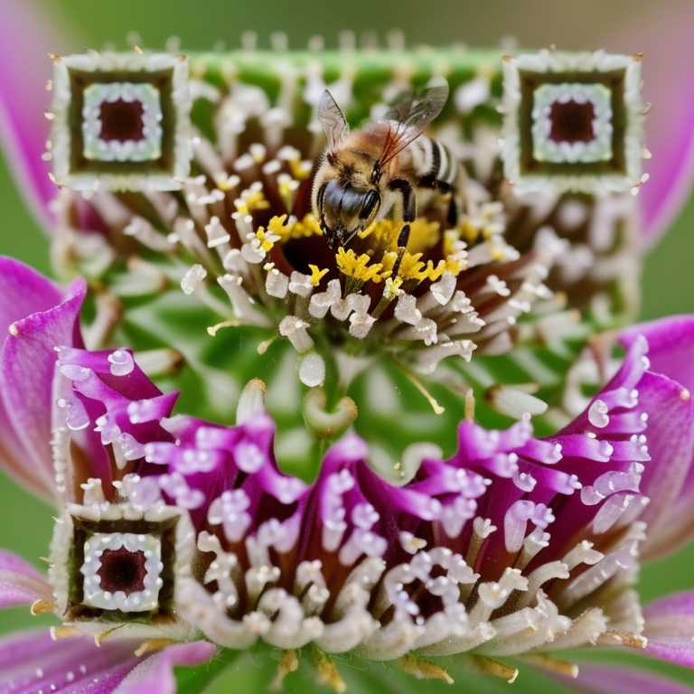</a>
       <b>Macro nature</b>
       extreme macro close-up photograph of a honeybee on a flower, sharp focus on intricate microscopic detail, shallow depth of field, dramatic n…
       ★ 0.98 · seed 1889893413 · scale 1.15 · photoreal
    </td>
  </tr>
</table>

## 📱 Tech & Brand

<table>
  <tr>
    <td align="center" width="33%" valign="top">
      
       <b>Product macro</b>
       extreme close-up macro photograph of a vintage DTMF keypad, sharp specular highlights catching every detail, intricate surface texture, dram…
       ★ 0.98 · seed 2135821963 · scale 1.15 · cyberrealistic
    </td>
    <td align="center" width="33%" valign="top">
      <a href="gallery/vintage-telecom.png">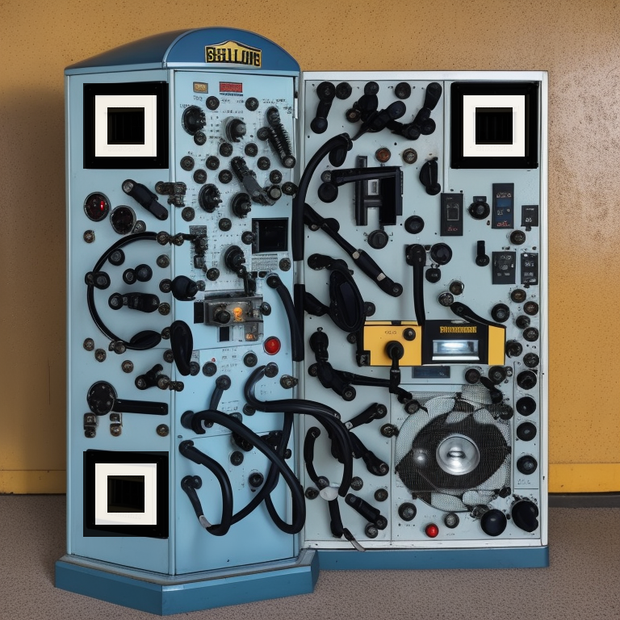</a>
       <b>Vintage telecom / retro tech</b>
       vintage BellSouth payphone booth, vintage telecom equipment, polished chrome and signal-blue palette, warm amber backlight, dramatic shadow…
       ★ 0.97 · seed 407912190 · scale 1.28 · cyberrealistic
    </td>
    <td align="center" width="33%" valign="top">
      
       <b>Modern circuits / data</b>
       data center server room corridor, glowing cyan fiber optic cables, server racks with cascading LED indicators, holographic data flow visuali…
       ★ 0.98 · seed 1057334972 · scale 1.18 · cyberrealistic
    </td>
  </tr>
</table>

## 🍽️ Lifestyle & Culture

<table>
  <tr>
    <td align="center" width="33%" valign="top">
      <a href="gallery/fashion-editorial.png">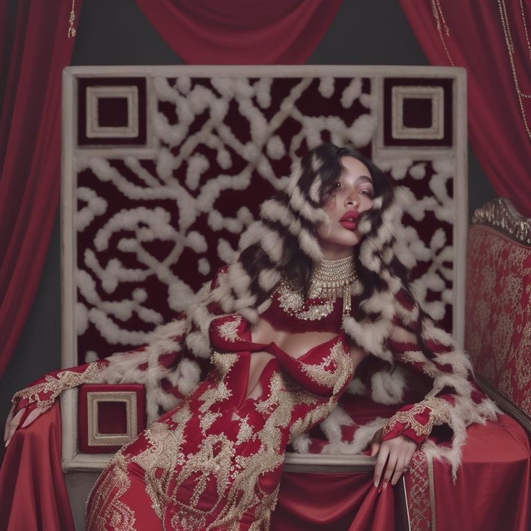</a>
       <b>Fashion editorial</b>
       model in flowing crimson gown, high fashion editorial photograph, dramatic studio lighting, intricate fabric texture and pattern detail, con…
       ★ 0.97 · seed 855543257 · scale 1.25 · majicmix
    </td>
    <td align="center" width="33%" valign="top">
      <a href="gallery/pet-portrait.png">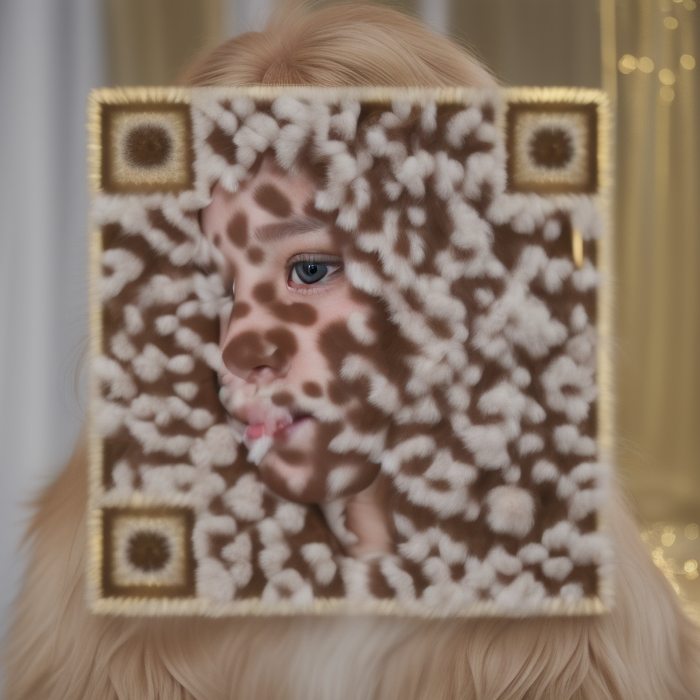</a>
       <b>Pet portrait</b>
       golden retriever puppy, professional pet portrait, sharp focused eyes, detailed fur texture, expressive personality, soft studio lighting, s…
       ★ 0.98 · seed 2123333479 · scale 1.45 · majicmix
    </td>
    <td></td>
  </tr>
</table>

## 🌏 Cultural traditions

<table>
  <tr>
    <td align="center" width="33%" valign="top">
      <a href="gallery/persian-miniature.png">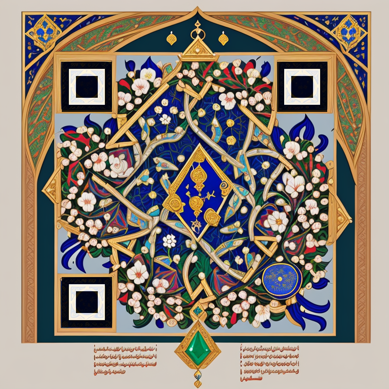</a>
       <b>Persian miniature</b>
       a royal court scene, traditional Persian miniature painting, ornate flat illuminated manuscript style, intricate floral and geometric border…
       ★ 0.97 · seed 1875179045 · scale 1.45 · dreamshaper
    </td>
    <td></td>
    <td></td>
  </tr>
</table>
